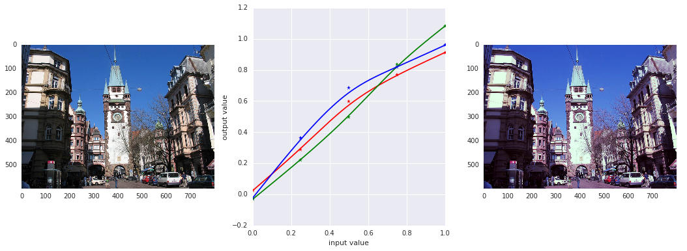

# Multidimensional (2D and 3D) Image Augmentation for TensorFlow

**TL;DR: The code in this directory provides TensorFlow Ops for multidimensional
volumetric image augmentation.**

## Motivation

Data augmentation during training helps a lot for generalization of the models
and prevents (or reduces) overfitting to the training data set. It can be
regarded as incorporation of prior knowledge about class-preserving
transformations. For images these class-preserving transformations usually
include spatial transformations (translation, rotation, scale, shear, and
elastic) and intensity transformations (linear mappings like brightness,
contrast, and non-linear mappings like gamma-corrections). All these variations
can be imposed by the imaging process (imaging device position and orientation,
device parameters, illumination, etc.) for an identical real world object.
Additionally the real world object might undergo class-preserving
transformations, like elastic deformations (e.g. a snail). Finally different
instances of the same object class (e.g. leafs on a tree) might look like
deformed versions of another instance.

## Spatial Transformations

The key features of this implementation of spatial transformations are:

*   all types of spatial transformations (translation, rotation, scale, shear,
    and elastic) with a single convenient interface
*   very fast: all transformations get combined before they are applied to the
    image
*   same transformation can be efficiently applied to multiple images (e.g. raw
    image, segmentation map, loss weight map)
*   different interpolations (nearest, linear) and extrapolations (zero-padding,
    const-padding, mirroring)
*   on-the fly conversion of segmentation maps to one-hot-encoding with linear
    interpolation in each resulting channel
*   implementations for planar (2D) and volumetric (3D) images, single channel
    (e.g. gray images) or multi-channel (e.g. RGB images)

For maximal flexibility the implementation consists of three main steps:

1.  Setup a grid of control points and apply all spatial transformations to the
    control points. This is very fast compared to operations on the full image
    (blue stars in the Figure)
1.  Compute a dense transformation field using cubic bspline interpolation
    (illustrated by the red grid in the Figure)
1.  Apply the dense transformation field to image, segmentation map, and loss
    weight map using appropriate interpolation and extrapolation strategies
    (output image in the Figure)

## Intensity Transformations

Intensity or color augmentation helps to teach the network desired robustness
and helps to reduce overfitting. Standard color augmentations (contrast,
brightness) are often implemented as linear transforms, and so will most likely
be directly compensated by the input normalization of a network. So we want to
have non-linear augmentations (like gamma-correction and the S-curves in
Photoshop). Trying to combine these two and find a reasonable parameterization
ended in a nightmare, so here is a more straight-forward alternative.

Instead of finding a parameterization, we just define the contraints to the
mapping function -- which is much easier and intuitive (for the examples we
assume float gray values between 0 and 1)

*   the new "black point" should be within a certain range (e.g., -0.1 to 0.1)
*   the new "white point" should be within a certain range (e.g., 0.9 to 1.1)
*   the function should be reasonable smooth
*   the slope of the function should be bounded (e.g., between 0.5 and 2.0)

The algorithm first samples control points (here 5) and then computes the smooth
function via cubic bspline interpolation

1.  sample a random value from the "black range" for the control point at 0, the
    new "black point"
1.  sample a random value from the "white range" for the control point at 1, the
    new "white point"
1.  recursively insert a new control point between the existing ones. Sample its
    value such that the slope constraints to both neighbours are fulfilled
1.  compute the smooth mapping function via cubic bspline interpolation

